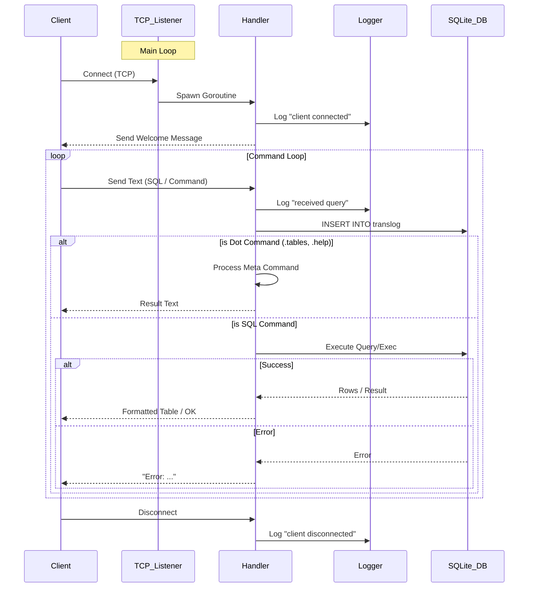

# Component Layout & Architecture

## Overview

gosqueal is a specialized TCP server that wraps an in-memory SQLite database
enabled with vector search capabilities. It provides a Telnet-compatible
interface for executing SQL queries and managing vector data.

## Component Architecture

The application is structured as a single-binary microservice with the
following core components:

### 1. Entry Point (main.go)

- **Configuration**: Parses command-line flags (-host, -port) and environment
  variables (HOST, PORT).
- **Initialization**: Sets up structured logging, registers the custom SQLite
  driver, and initializes the in-memory database.
- **Listener**: Starts a TCP listener and handles graceful shutdown via OS
  signals (SIGTERM, SIGINT).

### 2. Database Layer

- **Engine**: SQLite3 via github.com/mattn/go-sqlite3 (CGO enabled).
- **Extensions**: Loads sqlite-vss (Vector Similarity Search) extensions
  dynamically.
- **Schema**:
  - translog: Internal audit log for all queries.
  - vectors: Virtual table for vector embeddings.

### 3. Connection Handler

- **Concurrency**: Spawns a new goroutine (handleConnection) for each TCP
  client.
- **Protocol**: Line-based text protocol using bufio.Scanner. Compatible with
  raw Telnet.
- **Output**: Uses text/tabwriter to format SQL results into aligned tables.

### 4. Command Processors

- **Dot Commands (handleDotCommand)**: Handles meta-commands like .tables,
  .schema, .help.
- **SQL Commands (handleSQLCommand)**: Executes standard SQL queries.
  Distinguishes between SELECT (Query) and INSERT/UPDATE (Exec).

## Error Handling Strategy

- **Startup Criticality**: The application fails fast (log.Fatal) on
  initialization errors (e.g., failed to load extensions, bind port, or open
  DB).
- **Runtime Resilience**:
  - Connection errors are logged but do not crash the server.
  - SQL execution errors are returned to the client as text messages (e.g.,
    Error: ...) and do not terminate the connection.
- **Transaction Safety**: Errors writing to the internal translog are logged as
  errors but do not block the main client query.

## Logging Strategy

- **Library**: Uses github.com/rs/zerolog for high-performance, structured JSON
  logging.
- **Output**: Logs are written to stderr.
- **Audit Trail**:
  - **System Logs**: Connection events, server status, and internal errors.
  - **Data Logs**: Every client query is inserted into the internal translog
    table with a timestamp and client IP.

## Architecture Diagram

